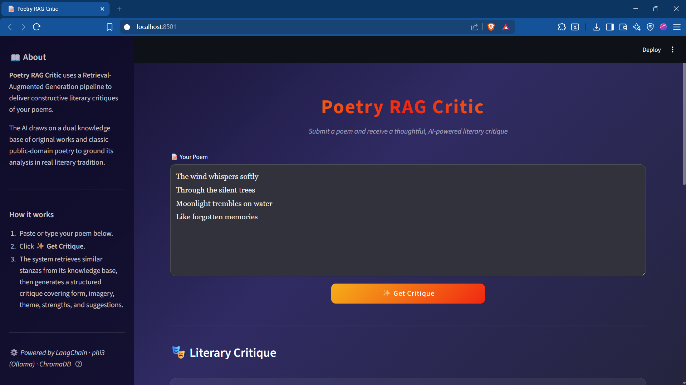
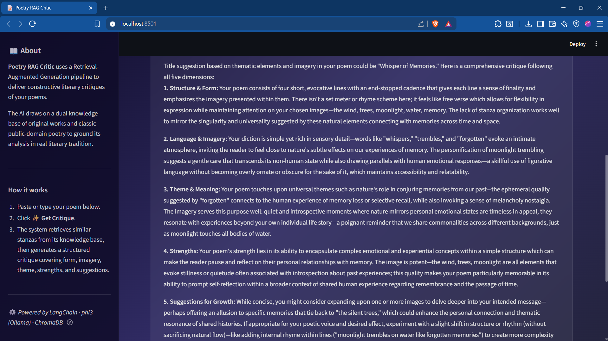

# 📝 Poetry RAG Critic

A Retrieval-Augmented Generation application that delivers constructive literary critiques of English poems. It draws on a dual knowledge base of original and classic public-domain poetry to provide structured, insightful feedback on form, imagery, theme, and craft.


---
## Working demo



## 🏗️ Tech Stack

| Component | Technology |
|---|---|
| **Frontend** | Streamlit |
| **Orchestration** | LangChain (LCEL) |
| **Embeddings** | `all-MiniLM-L6-v2` (sentence-transformers) |
| **Vector Store** | ChromaDB (persistent, local) |
| **LLM** | Phi3 via [Ollama](https://ollama.com) |
| **Data Parsing** | pypdf |
| **Containerization** | Docker + Docker Compose |

---

## 📂 Project Structure

```
PoetryRAG/
├── app.py                        # Streamlit web UI
├── config.py                     # Central configuration
├── requirements.txt              # Python dependencies
├── Dockerfile
├── docker-compose.yml
├── data/
│   ├── my_poems/                 # Your original poems (PDF)
│   └── public_poems/             # Public-domain classics (PDF)
└── src/
    ├── ingestion/
    │   ├── pdf_loader.py         # PDF extraction & preprocessing
    │   └── poetry_splitter.py    # Custom stanza-based text splitter
    ├── vectorstore/
    │   └── chroma_store.py       # ChromaDB + embedding integration
    └── chain/
        ├── prompts.py            # System persona & prompt template
        └── critique_chain.py     # LCEL chain with retry logic
```

---

## 🚀 Getting Started (from GitHub)

### Prerequisites

- **Python 3.10+**
- **Ollama** — [Download here](https://ollama.com/download)

### 1. Clone the repository

```bash
git clone https://github.com/Samriddha49/PoetryRAG.git
cd PoetryRAG
```

### 2. Install Python dependencies

```bash
pip install -r requirements.txt
```

### 3. Set up Ollama

Install Ollama from [ollama.com](https://ollama.com/download), then pull the Phi3 model:

```bash
ollama pull phi3
```

Make sure the Ollama server is running:

```bash
ollama serve
```

> **Note:** On Windows, Ollama typically runs as a background service after installation. If it's already running, you can skip `ollama serve`.

### 4. Add your poems

Place your PDF poems in the appropriate directories:

- `data/my_poems/` — your original works (at least 12 recommended)
- `data/public_poems/` — curated public-domain classics

Sample poems are included out of the box. To generate fresh placeholder poems:

```bash
pip install fpdf2
python scripts/generate_sample_pdfs.py
```

### 5. Run the application

```bash
streamlit run app.py
```

Open **http://localhost:8501** in your browser. On first launch, the app will automatically ingest the PDFs, chunk them into stanzas, embed them, and store them in ChromaDB. Subsequent launches skip this step.

---

## 🐳 Getting Started (Docker)

### Prerequisites

- **Docker** and **Docker Compose**
- **Ollama** running on your host machine with `phi3` pulled

### 1. Clone and build

```bash
git clone https://github.com/Samriddha49/PoetryRAG.git
cd PoetryRAG
docker compose up --build
```

### 2. Pull the Phi3 model (if not already done)

In a separate terminal:

```bash
ollama pull phi3
```

### 3. Access the app

Open **http://localhost:8501** in your browser.

### Docker Compose Services

| Service | Purpose | Port |
|---|---|---|
| `poetry-rag-critic` | Streamlit app | `8501` |
| `ollama` | LLM server | `11434` |

### Persistent Volumes

- `./chroma_db` — ChromaDB vector store (survives container restarts)
- `./data` — poem PDF files (mounted into the container)
- `ollama_data` — downloaded Ollama models

> **Tip:** To rebuild the vector store from scratch (e.g. after adding new poems), delete the `chroma_db/` folder and restart.

---

## 📖 How It Works

1. **Ingest** — PDFs from both corpus directories are loaded and preprocessed (headers, footers, and page numbers stripped).
2. **Chunk** — A custom LangChain `TextSplitter` splits poems on stanza breaks (blank lines) instead of character counts, preserving poetic structure.
3. **Embed** — Stanza chunks are embedded using `all-MiniLM-L6-v2` and stored in ChromaDB.
4. **Retrieve** — When a user submits a poem, the top-5 most similar stanzas are retrieved from both corpora.
5. **Critique** — The user's poem + retrieved context are fed into a literary-critic persona prompt, and Phi3 generates a structured critique covering form, imagery, theme, strengths, and suggestions.

---

## ⚙️ Configuration

All settings are in [`config.py`](config.py):

| Setting | Default | Description |
|---|---|---|
| `EMBEDDING_MODEL` | `all-MiniLM-L6-v2` | Sentence-transformers model |
| `LLM_MODEL` | `phi3` | Ollama model name |
| `OLLAMA_BASE_URL` | `http://localhost:11434` | Ollama server address |
| `RETRIEVAL_TOP_K` | `5` | Number of similar chunks to retrieve |
| `CHROMA_COLLECTION_NAME` | `poetry_rag` | ChromaDB collection name |

---

## 🛠️ Troubleshooting

| Issue | Solution |
|---|---|
| **"Cannot connect to Ollama"** | Ensure Ollama is running: `ollama serve` |
| **"Model not found"** | Pull the model: `ollama pull phi3` |
| **No poems in knowledge base** | Add PDFs to `data/my_poems/` and `data/public_poems/`, then restart |
| **Stale vector store** | Delete `chroma_db/` folder and restart the app |

---

